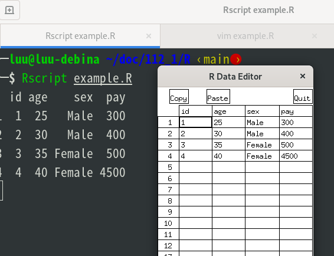

# R語言入門

- [R語言官網](https://www.r-project.org/)
- [R語言台灣鏡像佔](https://cran.csie.ntu.edu.tw/)

## 安裝

```
sudo apt update
sudo apt install r-base r-base-dev
```

## R物件

- Vector
- Array 
- Matrix
- Factor 
- Data Frame

### 向量

向量是由相同資料型態的元素所組成，下面的範例就是由6個數值所組成的向量物件。

- c() : 代表為funtion 

```
> v <- c(10,5,3.1,6.4,9.2,21.7)
> v
[1] 10.0  5.0  3.1  6.4  9.2 21.7
```

### 陣列
陣列根據書本的說法是可將其視為向量。

#### 準備資料
```
> x <- 1:24
> x
 [1]  1  2  3  4  5  6  7  8  9 10 11 12 13 14 15 16 17 18 19 20 21 22 23 24
```
#### 設定成為度設定成3x4x2
```
> dim(x) <- c(3,4,2)
> x
, , 1

     [,1] [,2] [,3] [,4]
[1,]    1    4    7   10
[2,]    2    5    8   11
[3,]    3    6    9   12

, , 2

     [,1] [,2] [,3] [,4]
[1,]   13   16   19   22
[2,]   14   17   20   23
[3,]   15   18   21   24

```
#### 為度設定成4x6
```
> dim(x) <- c(4,6)
> x
     [,1] [,2] [,3] [,4] [,5] [,6]
[1,]    1    5    9   13   17   21
[2,]    2    6   10   14   18   22
[3,]    3    7   11   15   19   23
[4,]    4    8   12   16   20   24
>
```
### 矩陣
matrix就是個2為陣列，建立方法可以是用matrix()來建立
```
matrix(data = NA, nrow = 1, ncol = 1, byrow = FALSE, dimnames = NULL)
```
- byrow 表示矩陣資料室要按列來世按行的順序排列
- nrow 表示矩陣的列數
- ncol 表示矩陣的行數
- dimnames 表示可以幫行列命名
```
> x <- matrix(1:24, nrow=4, ncol=6, byrow=TRUE)
> x
     [,1] [,2] [,3] [,4] [,5] [,6]
[1,]    1    2    3    4    5    6
[2,]    7    8    9   10   11   12
[3,]   13   14   15   16   17   18
[4,]   19   20   21   22   23   24

> x <- matrix(1:24, nrow=4, ncol=6, byrow=FALSE)
> x
     [,1] [,2] [,3] [,4] [,5] [,6]
[1,]    1    5    9   13   17   21
[2,]    2    6   10   14   18   22
[3,]    3    7   11   15   19   23
[4,]    4    8   12   16   20   24
```
### 資料框架
與矩陣一樣是2維的，不同的特點是它內部的資料可以是不同型態的。

```r
  1 id <- c(1, 2, 3, 4)
  2 age <- c(25, 30, 35, 40)
  3 sex <- c("Male", "Male", "Female", "Female")
  4 pay <- c(300, 400, 500, 4500)
  5 x.dataframe <- data.frame(id,age,sex,pay)
  6 x.dataframe
  7 edit(x.dataframe)
```



### 因子

Factor 是特別的向量，它會記入資料的元素。
```r
  1 f <- factor(c("南","北","北","南","南","南"))
  2 f
  3
```

```
[1] 南 北 北 南 南 南
Levels: 北 南
```


### 列表

