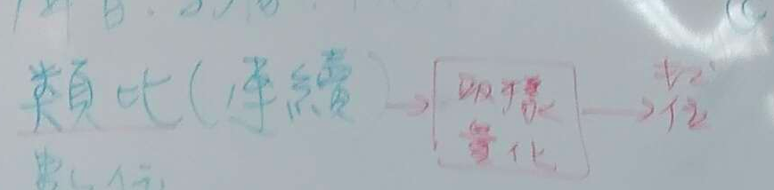

# ch1.
[參考資料](https://www.analog.com/en/design-center/landing-pages/001/beginners-guide-to-dsp.html)
## dsp 應用
特殊運用演算法
1. 降噪
1. 影像處理
1. 演算法 --> 處理器晶片

###  訊號的分類

1. 為度:聲音、影像、視訊
1. 形式:類比(連續) 數位

 

類比轉數位 

1. 取樣
1. 編碼

### 應用
1. 通訊:無限通訊,行動通訊
2. 網路.VDIP,頻寬 通訊vs 網路 新興的 商業模式,身活模式
2. 語音:辨識,合成，增強 -->語音 vs 文字間轉換
2. 視聽娛樂: 消費行電子
2. 生物醫學: 檢測儀器、醫護系統、預防醫學
2. 影像:合成/處里、動畫、ar/vr/mr 遊戲
2. 用用及太空: GPS.車連網交通
2. 民生工業: 網路監控（人臉、紅模、靜脈)\
    工業檢測（品管)
2. 金融科技: 各種包
 

