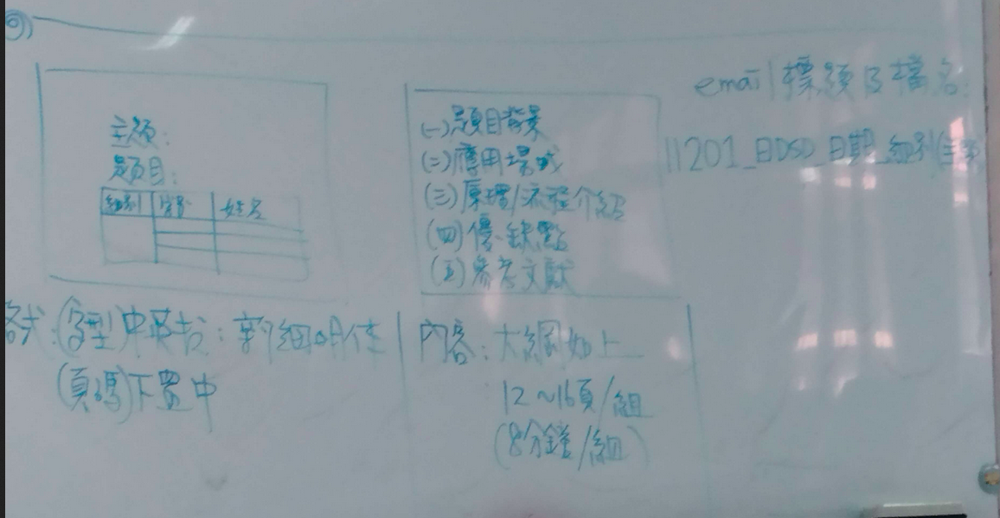

# ch1.

## dsp 應用
1. 訊號的分類\
1.1. 為度:聲音、影像、視訊\
1.2. 形式:類比(連續) 數位
1. 應用:\
  2.1 通訊:無限通訊,行動通訊\
  2.2 網路.VDIP,頻寬 通訊vs 網路 新興的 商業模式,身活模式\
  2.3 語音:辨識,合成，增強 -->語音 vs 文字間轉換\
  2.4 視聽娛樂: 消費行電子\
  2.5 生物醫學: 檢測儀器、醫護系統、預防醫學\
  2.6 影像:合成/處里、動畫、ar/vr/mr 遊戲\
  2.7 用用及太空: GPS.車連網交通\
  2.8 民生工業: 網路監控（人臉、紅模、靜脈\
      工業檢測（品管)\
  2.9 

###  訊號的分類
1. 為度:聲音、影像、視訊
1. 形式:類比(連續) 數位

### 應用
1. 通訊:無限通訊,行動通訊\
2. 網路.VDIP,頻寬 通訊vs 網路 新興的 商業模式,身活模式\
2. 語音:辨識,合成，增強 -->語音 vs 文字間轉換\
2. 視聽娛樂: 消費行電子\
2. 生物醫學: 檢測儀器、醫護系統、預防醫學\
2. 影像:合成/處里、動畫、ar/vr/mr 遊戲\
2. 用用及太空: GPS.車連網交通\
2. 民生工業: 網路監控（人臉、紅模、靜脈)\
    工業檢測（品管)
 

