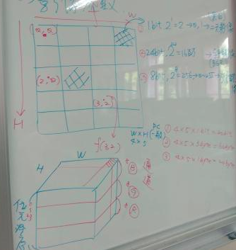

## 上課規則

- 平時 25
- 作業 30 上機,電子檔/紙本
- 其中 20 個人大作業
- 期末 25 組別報告

## 加分

1. 服務
1. 優良
1. 其他

## 扣分

1. 手機
1. 實物
1. 環境

上課時間下午0200到0430

---

# 影像處里

##  一  影像處理參數

WxH 4x5


### pixel.像數/畫數

影像的最小單元，會影響影大小。

### bit-depth 位元深度
每個pixel上顏色或亮度使用到的bit數
1. 當只有1bit的時候就被稱為黑白影像。
1. 8bit $2^8$ 灰階影像
1. 24bit就有$2^{24}$個表示又稱為全彩影像，bgr

所佔用的空間

- $4*5*2^1$bit
- $4*5*2^8$bit
- $4*5*2^{24}$bit

### 原點
在片的左上角，並在格子中。
### 座標1. (w*h) 水平 在 垂直 --> 單純指出某個座標or影像大小
1. (h*w) 垂直 在 水平 --> 之後會取出像數值來做處理
### 座標直

指的是顏色

### channel 通道
指的是將位元深度進行區分，如果是全彩的可分成BGR三個通道
1. f(h,w) = (b,g,r) # 全彩
1. f(h,w) = (0) # 灰階
1.


---

## open cv 參數

影像讀取的指令
```py
img=cv2.imread('Lena.tiff',1)
```

### img.shape
影像尺寸資料(h,w,c) 高 寬 通道數
- 
- 全彩(5,4,3)
- 灰階(5,4)

### img.ndim
影像尺寸的為度
可以由尺判斷通道數。
不同特性的資料作法要注意。
```py
if (img.ndim == 3):
  全彩處里
else:
  灰階
```
### id(img)
在記憶體中的位址

```py
img1 = img
img2 = img.copy()
img1[10:30,10:40] = 255
img2[80:120,10:150] = 0
```
### type(img)
影像鄭列的資料型態


### img.dtype
影像鄭列中的元素的內容格式
- uint8 #無號的8bit整數資料

## 亮度 vs 顏色
要去學latex矩陣表示

- 相對位址
- 顏色: 彩度 , 亮度

彩度空間: hsv
亮度空間: yuv , ycbcy yiq


## 載入系統+ 變更工作路徑

```py
import os 
os.getcwd() #顯示
mywd = "/home/HserName" # 使用者的自訂路徑
os.chdir(mywd)#切換工作路徑

```

## 載入套件

```py
improt cv2
import numpy
```

## 讀取
cv2.imread('影像檔名',格式)


### 格式有3

1. cv2.IMEAD\_COLOR 以全彩/3通道來讀取
1. cv2.IMREAD\_GRAYSALE 灰階/1通道處理
1. cv2.INREAD\_UNCHANGED以省像本身尺寸來讀取

### 顯示秀圖

- cv2.namedWindow('視窗名',視窗格式)
- cv2.imshow('視窗名',影像陣列名)

#### 視窗格式有2

1. cv2.WINDOW\_AUTOSIZE 視窗隨影像大小開啟1
1. cc2.WINDOW\_NORMAL 視窗開啟之後可伸縮0

---

## 寫入

- cv2.imwrite('寫數影像檔名',影像陣列名)
檔名支援
- bmp
- tiff
- png
- jpg

## 等待&關閉

- cv2.waitKey(0)
- cv2.destroyAllWindows()

```py
img1 = cv2.imread('Lena.tiff',1)
img2 = cv2.imread('Lena.tiff',0)#或讀到Y
cv2.imshow('img1',img1)
cv2.imshow('img2',img2)

#觀察此時img1與img2的shape,ndim

img3 = cv2.imread('F16 256_8.bmp',1)
img3 = cv2.imread('F16 256_8.bmp',0)
# 觀察
cv2.imwrite('Dimg1.png',img1)
cv2.imwrite('Dimg2.png',img2)

```

## 補充
當要存檔的時候可以選用壓縮格式,jpg,這個下的指令如下
- cv2.imwrite('Lenal0.jpg',img1,[int(cv2.IMWRITE_JPEG_QUALITY),10])

1. 用Q=10,20,30來存檔
1. 觀察檔案大小(檔案總管中）
1. 顯示??

# 10-4

## 幾何處里

### 旋轉Rotation

```py
r_mat=cv2.getRotationMatrix2D((x,y),ang,scale)
r_img=cv2.warpAffine(src,r_mat,(w,h))

#(s,y):旋轉中心座標
#scale:縮放
#src:原始影像(處理前)
#(w,h):原始影像的尺寸(h,w)
```
### 旋轉(Transpose)

```py
r_img = cv2.transpose(src)
```

### 翻轉Flip

```py
f_img = cv2.flip(src,para)
"""
para: 1  水平
      0  垂直
      -1 水平家垂直
"""
```
### 縮放

```py
rsize_img = cv2.resize(src,dsize[,fx=None,fy=Node,interpolation=None])
"""
dsize:縮放後影響大小(水平,垂直)
fx,fy:沿水平軸 / 垂直軸縮放參數
                ()
interpolation:內插方法，常見的有如下:
    1. cv2.INTER_AREA #區域內插 (快但是效果不佳)
    2. cv2.INTERNEAREST#近鄰內插
    3. cv2.INTER_LINEAR#線性內插
    4. cv2.INTER_CUBIC#雙線性 (小果好但是 速度慢)
"""
```

### ex

```py
import cv2
import numpy

if __name__ == "__main__":
    img = cv2.imread('../img/Lena.tiff',-1)
    cv2.imshow('orginal',img)
    print('orig img size',img.shape)

    #1
    scale=1.5
    w= int(img.shape[1]*scale)
    h= int(img.shape[0]*scale)
    dsize=(w,h)
    rsize_img1 = cv2.resize(img,dsize, interpolation = cv2.INTER_AREA)
    cv2.imshow('AREA',rsize_img1)

    #2 
    rsize_img2 = cv2.resize(img, None, fx=0.5, fy=0.5, interpolation=cv2.INTER_NEAREST)
    cv2.imshow("NEAREST",rsize_img2)
    cv2.waitKey(0)
    cv2.destroyAllWindows()
```
# 10-11
----
# 繪圖
## 參數

- pt1.pt2:開啟座標(水平,垂直)
- color : 顏色
- thickness:厚度（線寬）(預設為1;整數)(-1:填充)
- lineType 線的種類(cv2.Line\_8)

## 建立空白圖像
- np.zeros((h,w,c),np.uint8) 
- np.ones((h,w,c),dtype='unity8')
### np.zeros((h,w,c),np.uint8) 
h:高
w:寬
c:通道
np.uint8 無號8位元整數資料

### 改變圖像顏色
img[:] = (B,G,R)\
        =(Y)

img.fill(Y) # 填滿

### 範例
```py
img1 = np.zeros((256,512,3),np.uint8)
img2 = np.ones((150,300),dtype = 'uint8')
cv2.imshow('img1',img1)
cv2.imshow('img2',img2)
img1[ : ] = ( , , )
img2.fill = ( )
```

## 直線
- cv2.line(img,pt1,pt2,color,thickness)
## 方框
- cv2.rectangle(img,pt1,pt2,color,tk)
## 方形
- cv2.circle(img,(w,h),r,color,tk)
## 橢圓
- cv2.ellipse(img,(w,h),軸長,旋轉角度,起始角度,結束角度,color,tk)
- 軸長=(短軸,長軸)
- 選轉角度:(角度>0:瞬時轉)
- 起始/結束角度 指定畫出橢圓的部份

## 範例
### 劃線-紅 ＋ 線寬5
cv2.line(img,(10,10),(150,10),(0,0,255),5)

### 矩形-綠色+線寬3（空心)
cv2.rectangle( )
### 矩形-藍色+線寬3（填滿)
cv2.rectangle( )

### 圓形-黃色+半徑15+線寬3
cv2.cirrle( )

## text 加入文字
openCV中加入的座標是文字的左下角PIL中加入" " 左上角
- cv2.putText(img,text,(w,h),字形,自大小,color,tk,linetype)

$$
^{p}_{cv2}he
$$

------
- fsize:文字的大小(預設=1,可為小數)

# 利用PIL套件加入文字

(中文)ImageDraw

1. 利用TTF 或是TTC字形檔 \
c:\\Windows\Fonts
1. from PIL import ImageFonl,ImageDraw,Image

## 力

```py
#0. 建立空白影像
    img = np.zeros((250,500,3),np.uint8)
    cv2.imshow('Ori',img)

    #1.定義需要加入的文字及其自行
    fext = '   happy\nNew Year'
    #fontPath1 = 'C:\\Windows\\Fonts\\prist'
    #linux use
    fontPath1 = '/usr/share/fonts/opentype/NotoSansCJK-DemiLight.ttc'

    #2 定義字形變數
    fl1 = ImageFont.truetype(fontPath1,100 )

    #3 將numpy 陣列轉為PIL影像( )
    imgP = Image.fromarray(img)

    #4在PIL影像上加入文字
    draw1 = ImageDraw.Draw(imgP)
    draw1.text((30,30) , fext, font=fl1, fill=(0,100,0))

    #5將PIL影像轉回Numpy陣列
    img2 = np.array( imgP )
    cv2.imshow('After', img2)
    cv2.waitKey(0)
    cv2.destroyWindow()

```

# ex

```py
text1 = "招財進寶"
text2 = "天天開心"
text3 = 'make a wish'
font1 = ' '
font2 = ' '
font3 = ' '
```

# 10-25

## 模主

### 模主 套件 名稱空間


1. 模主(mode)
1. 套件(package)
1. 命名空間(namespace)
載入模組或是見時python以此名稱建立的名稱空間。
此模組或套件內的寒式...須透過.做階乘取用
```py
dir()
#--------------------
import os 
dir()
#------------------
import sys
dir()
dir(argv)
dir(sys.argv)

### 載入方試
```py
#1.
import 模組or套件名
import 模主名.函數名
#2.
import 模主名 or 套件名 as 別名
import 模主名.函式名 as 別名
#3.
from 模主名 or 套件名 import 函式名
#
import matplotlib.pylot as plt
from PIL import Image,Image Dram
```
### 命名規則
### 指定
1. 單變數指定
```py
code 
a = 8
b = a 
a = [1,2]
' ',指定運算子,_______
```

### 多變數指定

方法
```py
a =1 
b =2 
c =3
pirnt(a,b,c)

a,b,c=1,2,3
print(a,b,c)
```
| | b=內容| c=a|d=a.copy()|
|--|--|--|--|
|a=8|相同|相同|x|
|a=2.5|不同|相同|X|
|a="app"|b相同|相同|x|
|a=[1,2]|不同|相同|不同|
|a=(1,2)|不同|相同|X|


# 11-1

## 變數命名規則

1. 易懂 有意義
1. 變數內容可用許改變的
1. 使用小寫字母，若為常數使用大寫字母
1. 名稱可由大小寫字母、底線、數字與中文組成，但是低一個字不可以是數字
1. 大小寫不同
1. 不可是保留字
1. 主副程式內的變入名稱允許相同，但若副程式內的變數不要傳出，則敬可能主副程式內變數取名不同

## 查詢保留字
```py
>>> import keyword
>>> keyword.kwlist
['False', 'None', 'True', 'and', 'as', 'assert', 'async', 'await', 'break', 'class', 'continue', 'def', 'del', 'elif', 'else', 'except', 'finally', 'for', 'from', 'global', 'if', 'import', 'in', 'is', 'lambda', 'nonlocal', 'not', 'or', 'pass', 'raise', 'return', 'try', 'while', 'with', 'yield']
```


## 多變數的宣告及改變內容直

|宣告|改變內容直|
|--|--|
|a=[1,2] ;b[1,2];c=a|a.append(3);print(a,b,c)|
| |a=8; print(a,b,c)|
|a=[1,2];b[1,2];d=a.copy()|a.append(3);print(a,b,d)|
| |a=8; print(a,b,c)|
1. c=a --> 讓c is a,兩者位址及內容相同
1. .copy()及.append(數值)只支援list
1. '=' --> 將變數重新指向另一位址

## 變數的範圍
### 主程式
內的變數，為全局變數;區域變數指出現在其他函式或副程式,全域變數的身命稱歧視整個*.py檔，區域變數則只在該函式或副程式中。
### 主副程式內的變數名
可以允許相同但為唯一存在：_____

==>釐清目前使用你一變數（內容直)

## ex

```py
def fun01():
  num=10
  print('在fun01中,num=',num)
def fun02():
  num =25
  print('在fun02中，num=',num)
num =8
fun01()
fun02()
print('在main中,num=',num)
```
### 概念
存在範圍

----

### 副程式有定義變數時

1. 宣告的方式 v.s改變的內容位址
1. 此變數為區域變數(與全域不同，不連動影響)
1. 副程式為定義變數的時候，會向外找全域變數

## 副程式有變數要保留/傳出時
1. 利用returm(變數)傳出
1. 利用宣告為"全域變數" global
多層副程式時最內層變數內容要保留道上遺層時宣告為"非區域變數" 
```py
nonlocal a
```
不同

```py
a=15
b=20
sum=a+b
def add_gol():
  global a,b,sum
  a=50
  b=40
  sum=a+b
  print("add_gol處:%3d=%3d+%3d"%(sum,a,b))
def add_re():
  a=55
  b=30
  sum=a+b
  print("add_re處:%3d=%3d+%3d"%(sum,a,b))
  return sum,a,b
def add_out():
  a = 30
  sum = a+b
  print("add_out處:%3d=%3d+%3d"%(sum,a,b))
  def add_in():
    nonlocal a 
    a=10
    b=25
    sum=a+b
    print("add_in處:%3d=%3d+%3d"%(sum,a,b))
  add_in()
  sum = a+b
  print("add_in後:%3d=%3d+%3d"%(sum,a,b))
print("主程式處:%3d=%3d+%3d"%(sum,a,b))
add_gol()
print("主試處(呼叫add_gol):%3d=%3d+%3d"%(sum,a,b))
sum,a,b =add_re()
print("主程式(add_re後):%3d=%3d+%3d"%(sum,a,b))
add_out()
sum=a+b
print("主程式(add_out()):%3d=%3d+%3d"%(sum,a,b))
```


